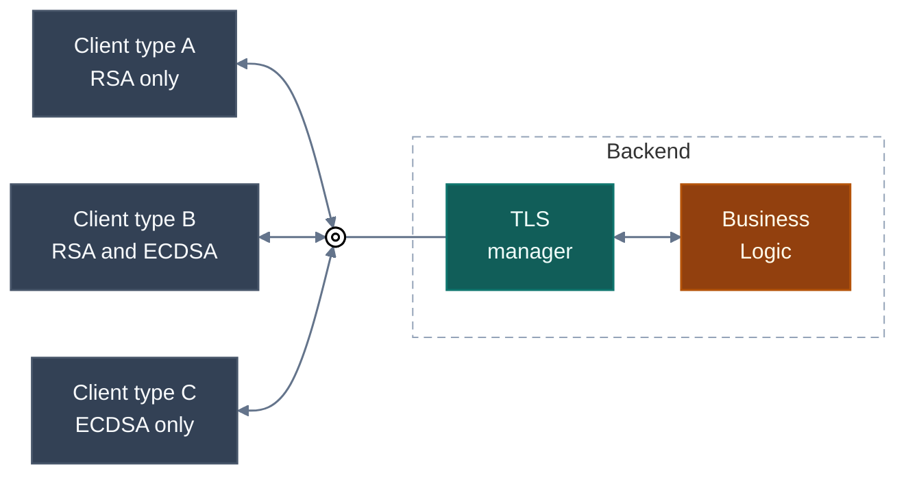
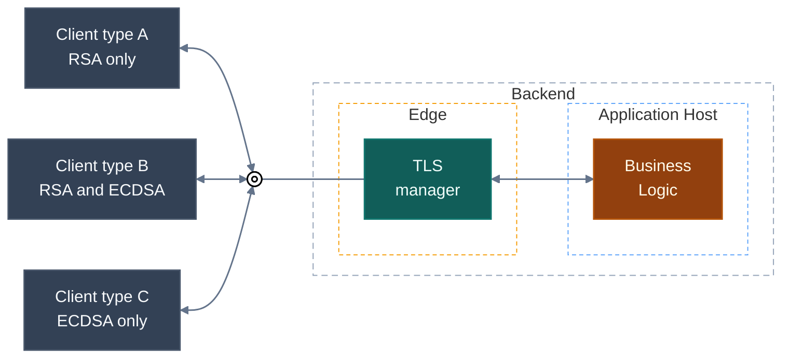
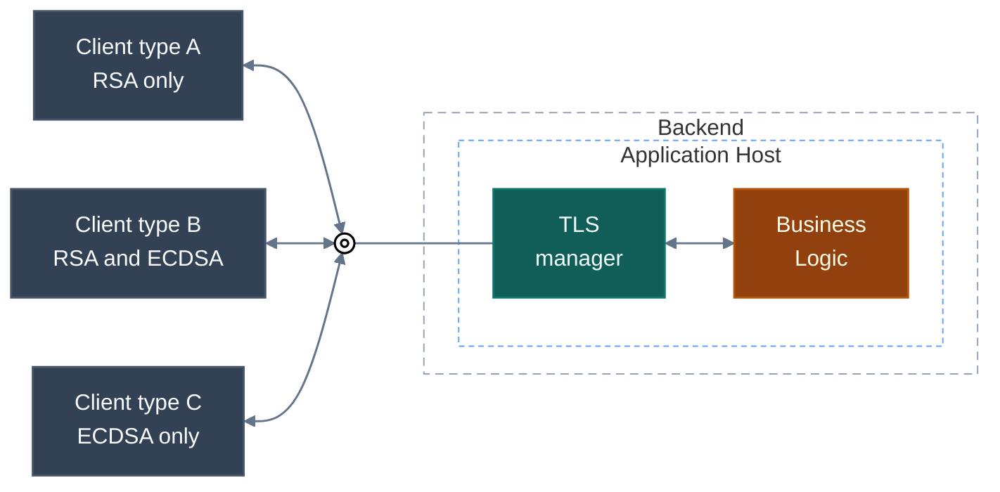

Most web servers are built for clients whose security behavior is handled by mainstream general-purpose operating systems.<br>
In that world, TLS certificate handling is usually straightforward: one server name, one endpoint, one certificate chain, and broad interoperability across the signature algorithms those stacks support.

The situation is different when clients fall outside that mainstream.

In IoT, device fleets, industrial gateways, legacy SDKs, or application-to-application integrations, clients often have hard restrictions on which server authentication algorithms, certificate public key types, and certificate signature schemes they can use.<br>
One client may support only RSA. Another may support only ECDSA. A third may support both.<br>
All of them still need to connect to the same logical endpoint under the same server identity.

That creates a specific requirement for the server: during the TLS handshake, it must inspect the client's capabilities and present a certificate with a key type and signature algorithm the client supports.

In this article, I will show how to implement that directly in ASP.NET Core and Kestrel, without moving certificate selection into an edge service such as a reverse proxy or an external gateway.

> ASP.NET implementation, and most of the information available on this topic, focus on SNI-based certificate selection, where different server names map to different certificates, which is not the case here.<br>
Because of that, LLM-based AI assistants conclude that this scenario is impossible to implement in ASP.NET.

> Note: The reader should have a deep understand of TLS, especially the negotiation phase of the handshake.

### Visualization

The visualisation below illustrates the exact case addressed in this article.<br>
The backend exposes one endpoint and clients have different capabilities.



## The Common Approach

The case is not unique and occurs frequently in some areas.<br>
It is often addressed by offloading TLS certificate management to a dedicated edge service placed in front of the web server.<br>
More specifically, that edge service is often a reverse proxy such as NGINX or HAProxy, or a managed edge gateway such as Azure Application Gateway.

While this approach certainly works, it also brings significant drawbacks, such as:
- one more network hop,
- one more system to provision,
- one more availability domain,
- one more place where TLS configuration can drift,
- one more operational surface that costs money and must be managed.

In mutual TLS scenarios, this is even less attractive.
Once certificate negotiation and identity extraction move to an edge service, authentication logic gets split across services.
The edge service now owns part of the security model, while the application owns another part.

### Visualization



## The Optimal Approach

For this specific case, the cleanest design is to keep certificate selection inside the application host.

That produces a much cleaner model:

- There is no extra hop and no extra failure point.
- TLS management stays with the host that actually owns the endpoint.
- Certificate selection is implemented exactly where the handshake happens.
- mTLS-related logic can stay in one place.

### Visualization



## How Server-side Certificate Selection Works

Before moving forward, it is important to align on how server-side certificate selection works.

Server-side certificate selection must happen during the first phase of the TLS handshake: after the client sends [ClientHello][rfc_8446_clienthello] and before the server responds with [ServerHello][rfc_8446_serverhello].

The server-side flow is as follows:

1. Receive the incoming TLS record.
2. Parse the TLS record as [TLSPlaintext][rfc_8446_tlsplaintext] and verify that it carries a [Handshake][rfc_8446_handshake] message whose body is [ClientHello][rfc_8446_clienthello].
3. Extract the client capabilities relevant to certificate selection from [ClientHello][rfc_8446_clienthello].
4. Select the appropriate certificate based on client capabilities.
5. Respond with [ServerHello][rfc_8446_serverhello] caring selected certificate information.

The important caveat is that the location of the client capability information required for certificate selection depends on the TLS version used by the client:
- TLS 1.2: within [ClientHello.cipher_suites][rfc_8446_clienthello].
- TLS 1.3: in the [SignatureSchemeList][rfc_8446_signature_scheme_list] extension of ClientHello [Extensions][rfc_8446_extensions].

That is the entire mechanism.

## Implement using ASP.NET Core and Kestrel

Since ASP.NET Core 2.1, Kestrel provides [`HttpsConnectionAdapterOptions.ServerCertificateSelector`][ms-learn--server-certificate-selector-docs] for dynamic server certificate selection during TLS negotiation.

That property lets you assign a callback that returns the [`X509Certificate2`][ms-learn--x509certificate2-docs] to use for the connection.

Historically, this API was designed for SNI-based certificate selection, where the server name influences which certificate is returned.<br>
However, nothing prevents using a different certificate-selection logic, such as client capabilities provided in `ClientHello`.

The `ServerCertificateSelector` callback is invoked with an instance of [`ConnectionContext`][ms-learn--connection-context-docs].

A `TLSPlaintext` record that carries a `Handshake` with a `ClientHello` message is stored in the `ConnectionContext` instance and can be accessed through [`IMemoryPoolFeature.MemoryPool`][imemorypoolfeature-docs].

Since ASP.NET Core 10.0, Kestrel also provides [`HttpsConnectionAdapterOptions.TlsClientHelloBytesCallback`][ms-learn--tls-client-hello-bytes-callback-docs], which allows inspection of the incoming `TLSPlaintext` as a [`ReadOnlySequence<byte>`][ms-learn--readonlysequence-docs] before the certificate selection callback.

That is all that is required for the implementation.

## Demo

The implementation pattern is straightforward:

1. Register `TlsClientHelloBytesCallback`.
2. Parse the TLS record into a compact internal representation such as `RSA`, `ECDSA`, or both.
3. Store the parsed value in `ConnectionContext.Items`.
4. Register `ServerCertificateSelector`.
5. Read the parsed value and return the matching certificate.

In the demo, the HTTPS setup looks like this:

```csharp
void ConfigureHttpsOptions(HttpsConnectionAdapterOptions httpsOptions)
{
    httpsOptions.TlsClientHelloBytesCallback = OnTlsClientHelloBytes;
    httpsOptions.ServerCertificateSelector = SelectCertificate;
}
```

The callback parses the raw handshake message and stores the result on the connection:

```csharp
private static void OnTlsClientHelloBytes(ConnectionContext connectionContext, ReadOnlySequence<byte> data)
{
    var parseResult = TlsClientHelloParser.TryParse(data, out var signatureAlgorithms);

    if (parseResult == TlsClientHelloParseErrorCode.None)
    {
        connectionContext.Items["SignatureAlgorithms"] = signatureAlgorithms;
    }
}
```

The selector then chooses the certificate:

```csharp
private X509Certificate2? SelectCertificate(ConnectionContext? context, string? _)
{
    if (context is null)
    {
        return null;
    }

    if (!context.Items.TryGetValue("SignatureAlgorithms", out var value))
    {
        return null;
    }

    if (value is not TlsSignatureAlgorithms signatureAlgorithms)
    {
        return null;
    }

    if (signatureAlgorithms.HasFlag(TlsSignatureAlgorithms.ECDSA))
    {
        return certificateECDsa;
    }

    if (signatureAlgorithms.HasFlag(TlsSignatureAlgorithms.RSA))
    {
        return certificateRSA;
    }

    return null;
}
```

This is enough to support a single endpoint that can present either certificate depending on client capabilities.

The full demo, including the parser and integration tests, is available here:

- [GitHub repository][demo-repo]

The repository demonstrates:

- parsing raw `ClientHello` bytes,
- selecting RSA vs ECDSA certificates in Kestrel,
- validating behavior with integration tests,
- handling both TLS 1.2 and TLS 1.3 negotiation paths.

If you need this capability in a real system, the interesting part is not the amount of code. The interesting part is that the mechanism is much closer to the server than many teams assume.

Kestrel is already in the handshake path. With the right callback, certificate selection is just another transport decision.

## Final Point

If you have one logical endpoint and heterogeneous non-browser clients, deploying an extra TLS tier should not be your default response.

When the requirement is simply:

- same host,
- same application,
- different certificate algorithms per client capability,

ASP.NET Core can solve it where the problem actually lives: inside the server during TLS negotiation.

---

If you found this article useful, feel free to buy the author [a cup of coffee](https://ko-fi.com/stas_sultanov) ☕.

----
DIA 1
>> [Mermaid editor link][dia-1]

[ms-learn--server-certificate-selector-docs]: https://learn.microsoft.com/dotnet/api/microsoft.aspnetcore.server.kestrel.https.httpsconnectionadapteroptions.servercertificateselector
[ms-learn--tls-client-hello-bytes-callback-docs]: https://learn.microsoft.com/dotnet/api/microsoft.aspnetcore.server.kestrel.https.httpsconnectionadapteroptions.tlsclienthellobytescallback?view=aspnetcore-10.0
[ms-learn--connection-context-docs]: https://learn.microsoft.com/dotnet/api/microsoft.aspnetcore.connections.connectioncontext?view=aspnetcore-10.0
[ms-learn--readonlysequence-docs]: https://learn.microsoft.com/dotnet/api/system.buffers.readonlysequence-1
[ms-learn--x509certificate2-docs]: https://learn.microsoft.com/dotnet/api/system.security.cryptography.x509certificates.x509certificate2
[imemorypoolfeature-docs]: https://learn.microsoft.com/dotnet/api/microsoft.aspnetcore.connections.features.imemorypoolfeature
[demo-repo]: https://github.com/stas-sultanov/asp-net-multicert
[dia-1]: https://mermaid.ai/play?utm_source=mermaid_live_editor&utm_medium=main_menu#pako:eNqVUl1LwzAU_Suhw7cVdN2XQcR2bZ4URH1zMrI0W4sxiUmGDvG_m6Qf026Ku9BCzz33nJybfgRE5DSAwYqJN1JgZcD13ZyfnABucT3nwNYSk2fK84V9pCi5eZwHSQWBrIbmwVPFJayk3CzMVtIFJbnGljzzGHAYSC6W6lJvpBTKaJDN0vsYCM62BwXU3nj8Y_zur-GlMEVnerY3jV0GdwgvYWOvldjIOrfeLNcKy6JZwC53a-jKMH2DOV5TZQkP1_fO5KUCfvCwlJZg36wk2JSCt12n6MwVZb6hD64CXITh5d5lHA7-X66_or_IXRSEYfgtcUXafVdSNqPPo82W_fYTXX0AXWBJIVipkJSKfNab2olBCOPXDa5xK2qBW4pJUSOd_Ti6PtRzC_m16TfwvUsY1jqlK2ARm0CJZxq-lbmVOJPv_QbJsT29UngLueC0gWHv3FcfrErGYC_z1QdEMKFg79RX18ZGPN5nOM7S2bTxSTOE0LT1iSbTbBJ3fG5LTo_3GYyGUTRufAaT8WgYtz7IV9fH3dDxRihJolHcGCGUoTRpjaZoHA3S4PMLwVSSEw
[rfc_8446]: https://www.rfc-editor.org/rfc/rfc8446
[rfc_8446_handshake]: https://www.rfc-editor.org/rfc/rfc8446#section-4
[rfc_8446_clienthello]: https://www.rfc-editor.org/rfc/rfc8446#section-4.1.2
[rfc_8446_tlsplaintext]: https://www.rfc-editor.org/rfc/rfc8446#section-5.1
[rfc_8446_serverhello]: https://www.rfc-editor.org/rfc/rfc8446#section-4.1.3
[rfc_8446_extensions]: https://www.rfc-editor.org/rfc/rfc8446#section-4.2
[rfc_8446_signature_scheme_list]: https://www.rfc-editor.org/rfc/rfc8446#section-4.2.3
